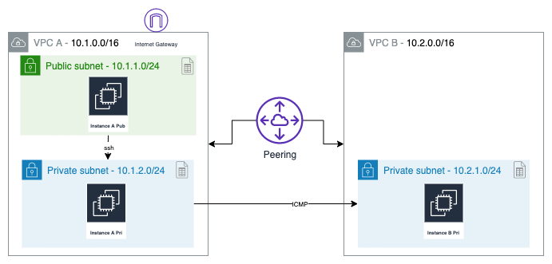

# VPC Peering

Conectar dos VPC y establecer comunicación entre subnets privadas



## Instrucciones

1. Crear una llave privada en la consola de EC2 con el nombre `peering` y cambiar los permisos con el comando

```bash
chmod 400 peering.pem
```

2. Utilizar el template de CloudFormation [peering.yaml](./peering.yaml) para levantar el Stack con las VPC, internet gateway, subnets, route tables, security e instancias:

```bash
aws cloudformation create-stack --stack-name peering --template-body file://peering.yaml
```

3. Revisar la pestaña de *Outputs* para obtener los valores de:

- InstanceAPubIP
- InstanceAPriIP
- InstanceBPriIP

4. Inicia el servicio de *SSH Agent* para hacer agent forwarding:

```bash
eval `ssh-agent -s`
```

Agrega la llave privada al keychain con:

```bash
ssh-add peering.pem
```

4. Utilizar el valor de `InstanceAPubIP` para hacer SSH a la instancia pública en la VPC-A. Utiliza la opción **-A** para hacer *agent forwarding*:

```bash
ssh -A ec2-user@InstanceAPubIP
```

5. Validar la conexión SSH hacia la instancia privada en la VPC-A con el valor de `InstanceAPriIP`:

```bash
ssh ec2-user@10.1.2.29
```

6. Intentar hacer `ping` a la instancia privada en la VPC-B con el valor de `InstanceBPriIP`:

```bash
ping InstanceBPriIP
```

7. Ir a la consola de VPC y crear una nueva conexión entre VPC-A y VPC-B en la sección `Peering Connections`:

Create Peering Connection

- **Peering connection name tag**: `Peer-A-B`
- **VPC (Requester)***: `VPC-A`
- **Account**: `My account`
- **Region**: `This region`
- **VPC (Accepter)**: `VPC-B`

8. Aceptar la conexión en la solicitud con status `Pending Acceptance` con click derecho y `Accept Request`

9. Agregar una ruta a la tabla de ruteo `RtAPri`:

- **Destination**: `10.2.1.0/24`
- **Target**: `Peering Connection` (Seleccionar la conexión previamente creada)

10. Agregar una ruta a la tabla de ruteo `RtBPri`:

- **Destination**: `10.1.2.0/24`
- **Target**: `Peering Connection` (Seleccionar la conexión previamente creada)

## Validación

Hacer ping desde la instancia `InstanceAPriIP` a `InstanceBPriIP`

## Limpieza

Borrar el Peer Connection y eliminar el stack de CloudFormation con:

```bash
aws cloudformation delete-stack --stack-name peering
```
